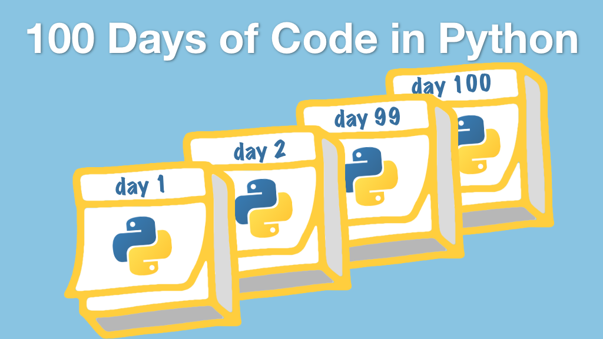
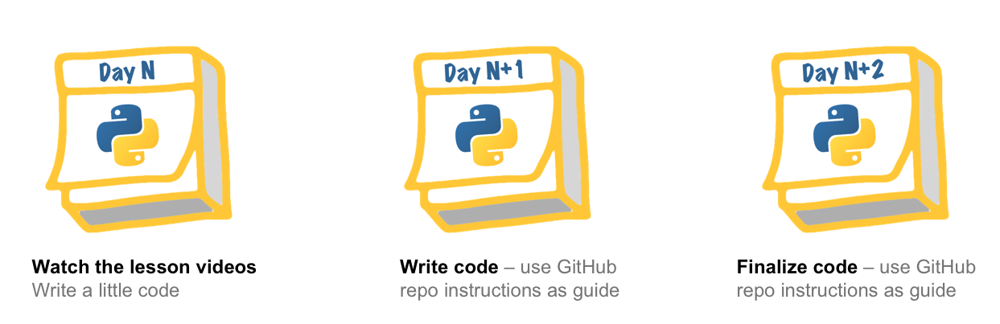

# #100DaysOfCode with Python course

Course details page: [**talkpython.fm/100days**](https://talkpython.fm/100days?utm_source=github)

## Course Summary

#100DaysOfCode in Python is your perfect companion to take the 100 days of code challenge and be successful. This course is 1-part video lesson, 2-parts guided projects. You will be amazed at how many Python technologies and libraries you learn on this journey. Join the course and get started.

## What's this course about and how is it different?

100 days of code is not just about the commitment. The true power and effectiveness is in having a guide and pursuing the "right-sized" projects. That’s why we have 33 deeply practical projects. Each paired with 20-40 minute lessons at the beginning of the project.

Just a small sampling of the projects you’ll work on include:

* Understanding basic Python data structures
* Searching large text corpuses with regular expressions
* Consume HTTP services including the Twitter and GitHub APIs among others
* Visual data with graphs using plotly
* Convert your Python CLI (command line interface) app to a GUI application
* Program against Excel in Python to automate your spreadsheet data
* Build a text-based game and learn object-oriented programming
* Automate multi-step web processes using selenium
* Test your code with pytest and unit testing
* Create a basic web app with Flask
* Create a JSON-based online game service using Flask too
* And 22 more projects!

View the [full course outline](https://training.talkpython.fm/courses/explore_100days_in_python/100-days-of-code-in-python).

## Who is this course for?

This course is for anyone who wants to immerse themselves in Python for 100 days worth of learning and hands-on projects.

We don’t start from absolute zero in terms of programming but if you are new to Python we have a language appendix and we start somewhat slow. By the end of the course, we get into intermediate-level Python projects.

## Course flow and the 33 projects

We have broken the 100 days worth of coding into 33 3-day segments. As you can see, the first day is largely learning the new topics (HTTP APIs, web scraping, databases, etc.). The following two days have some guidance but is much more hands-on than the first day.

## Get the full course details

Visit the full course page for all the details: [**talkpython.fm/100days**](https://talkpython.fm/100days?utm_source=github)
