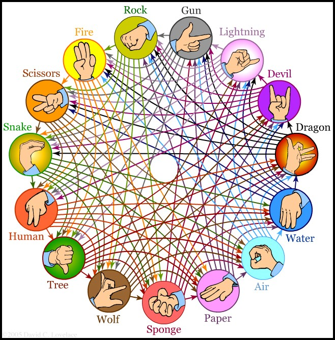

# Days 13-15 Text-based Games Challenges

Now that you have seen the videos from day 13 and have some experience with classes and objects, we are going to build another, slightly more complex (but fun!) game.

Perhaps you've heard of [**Rock Paper Scissors**](https://www.wikihow.com/Play-Rock,-Paper,-Scissors). This game is a popular kids game played with just your hands. Make a symbol (rock, paper, or scissors) and both players show their hand at the same time and there are rules about which symbols beat which others. Check out page for details.

[wikihow.com/Play-Rock,-Paper,-Scissors](https://www.wikihow.com/Play-Rock,-Paper,-Scissors)

We are going to build **Rock Paper Scissors**. That will be day 13, 14, and 15. 

For those of you who get through this challenge quickly and want a bigger challenge, we have something special to stretch yourself with. Behold, **15-way Rock Paper Scissors**!



Image credit: [David Lovelace](http://www.umop.com/rps15.htm)

Now, onto your challenges!

## Day 13: Learn about classes and get started

1. This day is mostly watching. Ensure that you have watched the corresponding video from the course.
2. Create a starter project that will be the foundation of **Rock, Paper, Scissors**. All it needs to do is ask the player for their name and print some sort of header telling them the title of the application.

## Day 14: Write standard **Rock, Paper, Scissors**

You will model **Rock, Paper, Scissors** with classes and a game loop. Recall the three rolls (Rock, Paper, and Scissors). These can be just hard coded into your game.

### Classes

`Roll`

* name of roll
* rolls that can be defeated by self
* rolls that defeated self

`Player`

* name of player

### Basic program flow

Your game loop code should look a little like this. It's not exact code but hopefully enough to get you moving without spoiling the fun of creating it. (Not every detail is shown)

```python
def main():
    print_header()

    rolls = build_the_three_rolls()

    name = get_players_name()

    player1 = Player(name)
    player2 = Player("computer")

    game_loop(player1, player2, rolls)
```

And here is the game loop

```python
def game_loop(player1, player2, rolls):
    count = 1
    while count < 3:
        p2_roll = None # TODO: get random roll
        p1_roll = None # TODO: have player choose a roll

        outcome = p1_roll.can_defeat(p2_roll)

        # display throws
        # display winner for this round

        count += 1

    # Compute who won
```

Bonus points if you address the possibility of a tie after three rounds.

## Day 15: Tidy up standard **Rock, Paper, Scissors**


## Advanced version

Do you have extra time left over and want to try the 15-way rock paper scissors? 

Behold **15-way Rock Paper Scissors**!


The way you read this graphic is if an arrow points from one item to another, that pointed-to item is defeated.

For example:

* Paper defeats rock (paper points to rock)
* Devil defeats human (devil points to human)

It turns out to be error prone and generally very unfun to work this out from the graphic. So I created a CSV score sheet representing these relationships. 

[`battle-table.csv`](data/battle-table.csv)

You can use that CSV data to hard code in the different scenarios, or you can read the CSV directly in Python and do it dynamically.

We haven't talked about CSV yet but if you're feeling adventurous, combine what is to follow with the little bit of code shown here that reads the rolls and inspects the wins and losses for each.

[`sample_reader.py`](data/sample_reader.py)

Modify the game you created for 3-roll rock paper scissors. Use the data in [`battle-table.csv`](data/battle-table.csv) to extend this from just Rocks, Paper, and Scissors, to the 15-way version.

Remember if you want to try to parse the CSV, you can borrow code from [`sample_reader.py`](data/sample_reader.py). 

Alternatively, you could simply hard code the table into the creation of the classes by creating the 15 types and setting who they defeat or are defeated by manually when creating them.

### Time to share what you've accomplished!

Be sure to share your last couple of days work on Twitter or Facebook. Use the hashtag **#100DaysOfCode**. 

Here are [some examples](https://twitter.com/search?q=%23100DaysOfCode) to inspire you. Consider including [@talkpython](https://twitter.com/talkpython) and [@pybites](https://twitter.com/pybites) in your tweets.

*See a mistake in these instructions? Please [submit a new issue](https://github.com/talkpython/100daysofcode-with-python-course/issues) or fix it and [submit a PR](https://github.com/talkpython/100daysofcode-with-python-course/pulls).*
