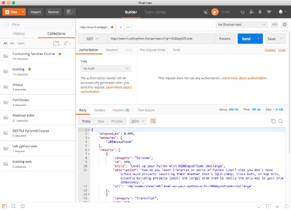

# Days 43-45 Searching via JSON APIs

Now you have seen the videos from day 43 and have some experience with JSON APIs. Over the next three days, we will build an application that lets you search Talk Python To Me using a JSON API.

## Day 43: Application skeleton

Today is mostly watching the corresponding videos from the course. Be sure to watch the videos first. Then:

1. Create a new empty Python project with a virtual environment
2. Reminder: Virtual environments are created using the commend `python3 -m venv .env` (use python rather than python3 for the command on Windows).
3. Activate the environment:
	* macOS / Linux: `. .env/bin/activate`
	* Windows: `.env/scripts/activate`
6. Install `requests` with `pip`
7. Create a `program.py` Python file and supporting `api.py` file 
8. Import requests inside the `api.py`, import api in `program.py`, and run `program.py` to make sure it's wall hanging together.
9. Install [Postman](https://www.getpostman.com/) for exploring the API.

## Day 44: Calling the API

Today, you will work with the search backend of [Talk Python To Me](https://talkpython.fm/): 

**[search.talkpython.fm](http://search.talkpython.fm/)**

Open that link and poke around a bit.

Now to properly explore the API, open Postman (you did install it the day before right?) and explore some of the search end-points. Study the structure of the resulting JSON.

[](./readme_resources/post.png)

Your goal today will be to flesh out `program.py` and `api.py` to:

1. Get a search word from the user
2. Call the search service via requests
3. Verify the success of this
4. Return basic dictionaries to `program.py` and list the resulting titles

You'll be done when you see something like:

```
$ python3 program.py

******* SEARCH TALK PYTHON *******
What keywords to search for? <ENTER WORDS>
There are 7 matching episodes:
1. Past, Present, and Future of IronPython
2. Deep Dive into Modules and Packages
3. Python at Netflix
4. ...
```

## Day 45: Polishing the application

Your app is basically working. Today we'll polish it up a bit with some code cleanup and user interaction.

Start with code cleanup. We have been passing dictionaries around. These are not so much fun. Let's use `namedtuples`. You create one like this:

```python
import collections

Movie = collections.namedtuple('Movie', 
   'imdb_code, title, director, keywords,'
   'duration, genres, rating, year, imdb_score')
```

Define a corresponding `namedtuple` for search results and refactor your code to use this type instead of passing raw dictionaries.

Now for the interaction cleanup. Once you display the results, ask the user if they want to view any of them (use an index, ask for a number of the listed ones or use the episode ID returned from the service (e.g. 142)). 

When they pick one, use the URL from the service response and open the users default web browser to that page. Sounds complicated, in Python it's just:

```python
import webbrowser
webbrowser.open(full_url, new=2)
```

Once you have that interaction working, you're done with these three days of the challenge!

### Time to share what you've accomplished!

Be sure to share your last couple of days work on Twitter or Facebook. Use the hashtag **#100DaysOfCode**. 

Here are [some examples](https://twitter.com/search?q=%23100DaysOfCode) to inspire you. Consider including [@talkpython](https://twitter.com/talkpython) and [@pybites](https://twitter.com/pybites) in your tweets.

*See a mistake in these instructions? Please [submit a new issue](https://github.com/talkpython/100daysofcode-with-python-course/issues) or fix it and [submit a PR](https://github.com/talkpython/100daysofcode-with-python-course/pulls).*
