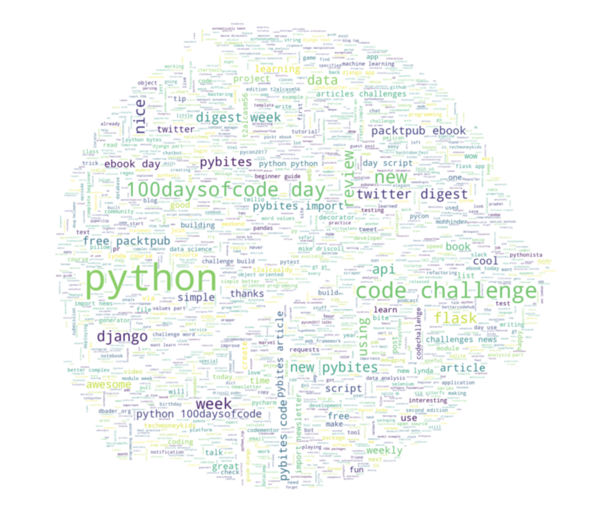

# Twitter Data Analysis with Python

In today's lesson we will do some analysis of Twitter data! If you want to follow along with the videos of this lesson, you can use [this notebook](https://github.com/talkpython/100daysofcode-with-python-course/blob/master/days/58-60-twitter-api/twitter-api.ipynb).

## Day 1: Retrieving tweets with Tweepy

First you will set up a [virtual environment](https://pybit.es/the-beauty-of-virtualenv.html), install `tweepy` and set some ENV variables.

Then we will retrieve PyBites tweets which we will put in a [nice wordcloud](https://github.com/amueller/word_cloud) in the shape of [our PyBites logo](https://codechalleng.es/static/img/pybites-premium.png).

Pretty exciting no?

## Day 2 and 3: Practice

We covered Twitter data analysis quite extensively on our blog. See [the notebook](https://github.com/talkpython/100daysofcode-with-python-course/blob/master/days/58-60-twitter-api/twitter-api.ipynb) for a listing of tools and challenges you can work on. As they are not small projects I bundled day 2 and 3 to focus on getting one working.

## Time to share what you've accomplished!

Be sure to share your last couple of days work on Twitter or Facebook. Use the hashtag **#100DaysOfCode**.

Here are [some examples](https://twitter.com/search?q=%23100DaysOfCode) to inspire you. Consider including [@talkpython](https://twitter.com/talkpython) and [@pybites](https://twitter.com/pybites) in your tweets.

See a mistake in these instructions? Please [submit a new issue](https://github.com/talkpython/100daysofcode-with-python-course/issues) or fix it and [submit a PR](https://github.com/talkpython/100daysofcode-with-python-course/pulls).
