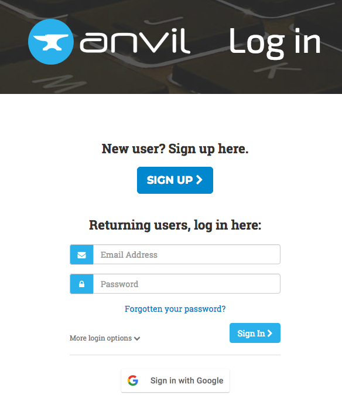
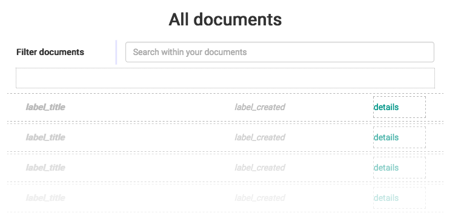
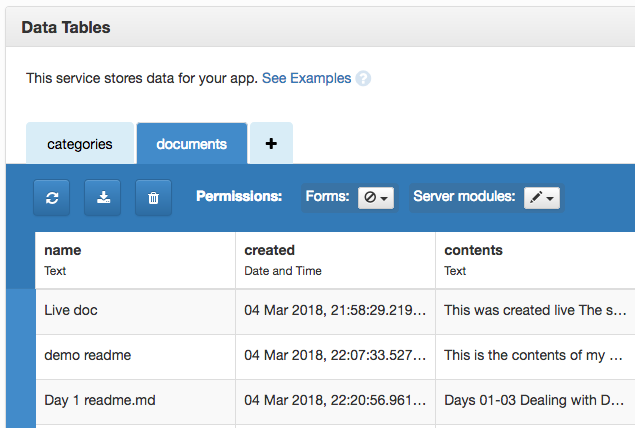
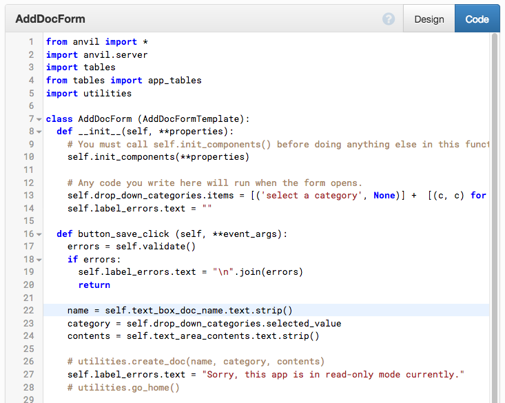
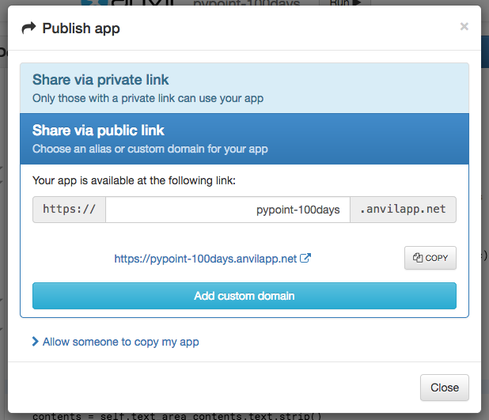

# Days 85-87 Full stack web made easy

Are you ready to write a full stack web app, the easy way? You'll use Anvil to build out an application of your choosing. Think of a simple app that you've seen us building or you have built during this course and recreate it using Anvil.

## Day N: Create the visual UI and interaction

Today you've watched quite a few videos. Round out today with a little exploration and drag-and-drop magic to build the UI.

First, you'll need to register at Anvil. Remember, if you use our code, you'll get 10% off a subscription if you decide you want one at a later date.

Create an account via: [**talkpython.fm/anvil100**](https://talkpython.fm/anvil100)

**Note:** *If you want to use the demo app in your account, the easiest way is to "clone it online" using this link: [anvil.works/ide#clone:5CHGY3Q6SBHQGA27=7WPAVZAGTUKSFK3QVI2XGV5U](https://anvil.works/ide#clone:5CHGY3Q6SBHQGA27=7WPAVZAGTUKSFK3QVI2XGV5U)*

*You can also see the live, read-only version of the demo app at: [pypoint-100days.anvilapp.net](https://pypoint-100days.anvilapp.net/)*

Once you have your account, create a new app (material design, side-bar style). Then

1. Add links to the various pages in the sidebar
2. Define subforms for each view you'll need (if there is only one just use the main form as your surface)
3. Fill out the visual design for the various forms (this includes naming the elements you'll interact with via code)

Day 1 is done! Go ahead and run your app just to see it come to life.

## Day N+1: Add the database and server code

On this, the second day, create the necessary database structures by adding a `service > data tables` and then defining the table structure.

You may or may not need this depending on what your application does.

Next, add a server module which has methods to allow you to get access to your data in a simple and clean manner. Recall you do this by adding a server module and the commented code will help you with the rest.

That's day 2!

## Day N+2: Putting it together

Finally, add the logic to your various forms. Start with the main form and making navigation via your menu possible. Then add the logic behind the buttons and other UI elements you created on day 1.

Finally, if this is something you'd like to share with the world, be sure to publish your app.

### Time to share what you've accomplished!

Be sure to share your last couple of days work on Twitter or Facebook. Use the hashtag **#100DaysOfCode**. 

Here are [some examples](https://twitter.com/search?q=%23100DaysOfCode) to inspire you. Consider including [@talkpython](https://twitter.com/talkpython) and [@pybites](https://twitter.com/pybites) in your tweets.

*See a mistake in these instructions? Please [submit a new issue](https://github.com/talkpython/100daysofcode-with-python-course/issues) or fix it and [submit a PR](https://github.com/talkpython/100daysofcode-with-python-course/pulls).*
