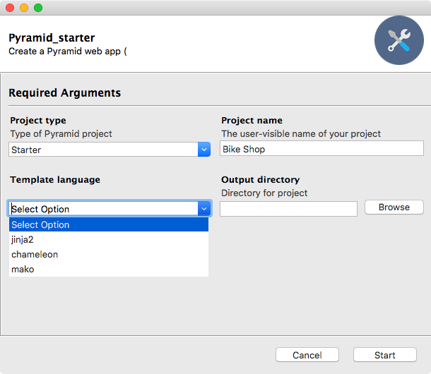

# Days 94-96 Packaging Python apps as GUIs

Now you have seen the videos from this chapter, you're ready to build your first Python GUI application. This is a fun one and a skill most Python enthusiasts never develop!

*Warning to Anaconda users*: I've heard reports of one of the dependencies in this chapter causing issues with Anaconda installs. Please use plain old Python 3 and a virtual environment (or a conda environment if you must use Anaconda).

## Day N: Application skeleton

Today is mostly watching the corresponding videos from the course. Be sure to watch the videos first. Then:

1. Create a new empty Python project with a virtual environment
2. Reminder: Virtual environments are created using the commend `python3 -m venv .env` (use python rather than python3 for the command on Windows).
3. Activate the environment:
	* macOS / Linux: `. .env/bin/activate`
	* Windows: `.env/scripts/activate`
6. Install `gooey` and `cookiecutter` with `pip`
7. Create a `program.py` Python file
8. Import `gooey` inside the `program.py` and run `program.py` to make sure it's wall hanging together.

Install note: If you are using Ubuntu (or Linux more generally), you'll probably need to install some foundational items before installing Gooey will succeed. Windows and macOS users should be fine with pip.

```bash
sudo apt-get install libwebkitgtk-dev libjpeg-dev libtiff-dev libgtk2.0-dev libsdl1.2-dev freeglut3 freeglut3-dev libnotify-dev libgstreamerd-3-dev

pip3 install gooey cookiecutter
```

## Day N+1: Building the GUI

Today you'll build your GUI application. You should have configured everything necessary on day 1. 

Now look through the applications that you have built for this course. Choose one you would like to convert to a GUI version. Note that apps with complex back and forth (e.g. Hi lo game, rock paper scissors, etc) are NOT good. You need an app that takes some input and then does a job.

Your goal today will be to flesh out `program.py`:

1. Implement the details of the app you selected
2. Mark the main method or entry point with `@Gooey()`
3. Create a `GooeyParser()`
4. Configure it for the inputs with `parser.add_argument()`
5. Call `parse_args()` on the parser
6. Use the resulting object to make the program work with those inputs

Once you have your app running the same but in a GUI version, you're done!

Here's an example of a fun little app I converted using GUI.



## Day N+2: Packaging the application

Now that you have an amazing GUI app in Python, let's make it sharable. 

Currently, you'd have to share your scripts, have the users use the terminal / command prompt, configure Python 3 and dependencies. Yuck.

We'll use PyInstaller to fix this.

Activate your virtual environment from your app. Install `pyinstaller` with `pip`.

Create a build.spec file. I suggest you "borrow" this one and just change the path and name:

[**`demos/final_search_app/build.spec`**](demos/final_search_app/build.spec)

Put this file next to your `program.py`. Run Pyinstaller with the following command.

```bash
$ pyinstaller build.spec
```

After awhile, you should have an executable in `./dist/APP_NAME`

Double-click it and verify you now have a running "full" application. 

Note that on macOS you need to zip this thing to share it (apps are really a directory on macOS).

### Time to share what you've accomplished!

Be sure to share your last couple of days work on Twitter or Facebook. Use the hashtag **#100DaysOfCode**. 

Here are [some examples](https://twitter.com/search?q=%23100DaysOfCode) to inspire you. Consider including [@talkpython](https://twitter.com/talkpython) and [@pybites](https://twitter.com/pybites) in your tweets.

*See a mistake in these instructions? Please [submit a new issue](https://github.com/talkpython/100daysofcode-with-python-course/issues) or fix it and [submit a PR](https://github.com/talkpython/100daysofcode-with-python-course/pulls).*
